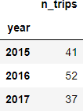

# call-a-bike-hackathon
Python code analysing DB's Call-a-Bike data for the CorrelAid LC-Rheinmain hackathon

## Location of bike stations in Hamburg

## Number of bike rides by time of day

## How many poor souls spent the first minutes of the new year on a Call-a-bike? 

For each year in the dataset, the following table counts the number of trips that started on December 31 of the previous year and ended on January 1 of that year:

## Top 10 pairs of start and end stations by number of trips
The following table lists the top 10 routes (`start` to `end`) by number of trips (`n_trips`). It also includes the cumulative share of the total observations accounted for by those routes (`cum_share`) as well as the share of missing observations, i.e. days without any recorded trips (`share_NaN`) in relation to the entire sample period:

