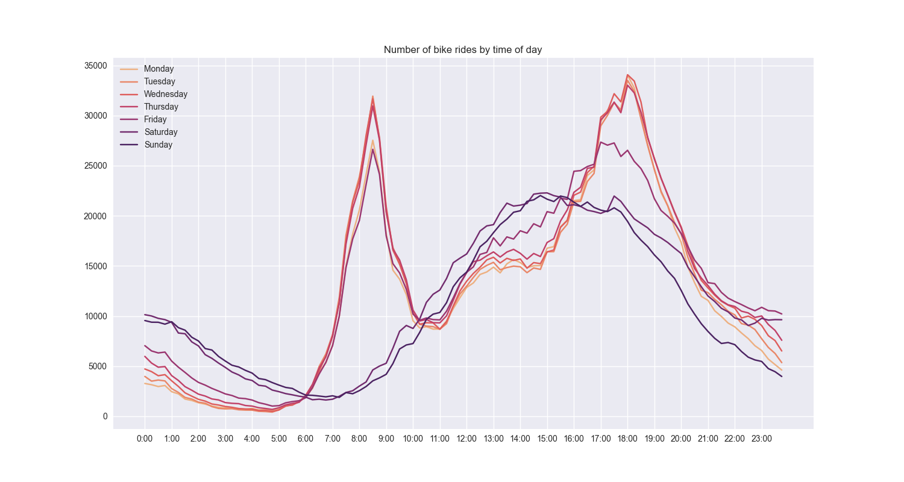

# call-a-bike-hackathon
Python code analysing DB's Call-a-Bike data for the CorrelAid LC-Rheinmain hackathon

## Location of bike stations in Hamburg

## Number of bike rides by time of day

## How many poor souls spent the first minutes of the new year on a Call-a-bike? 

